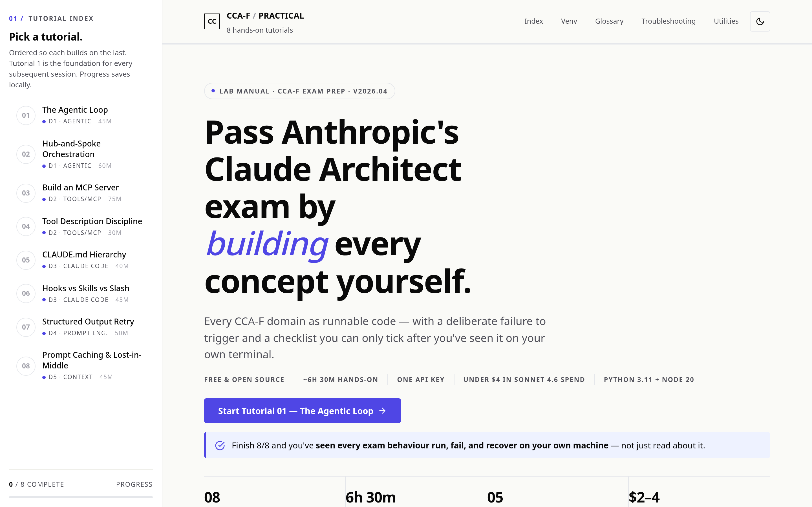
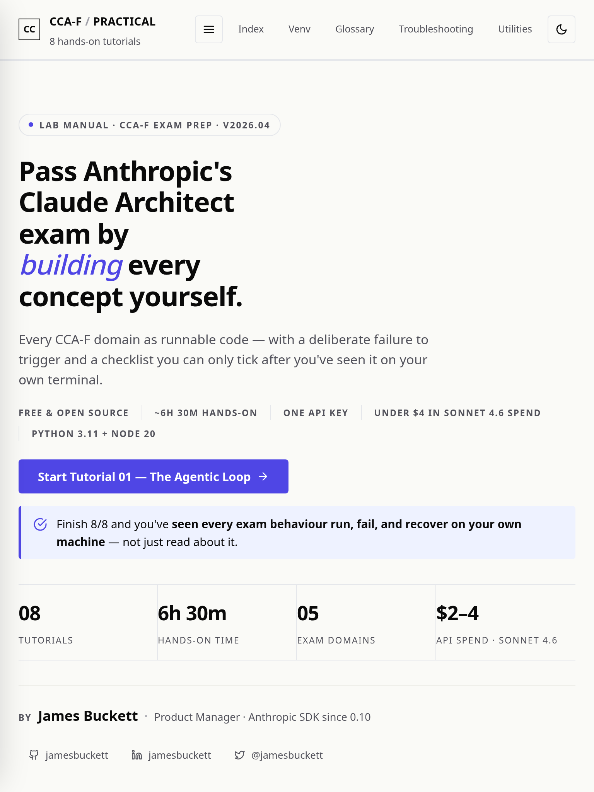
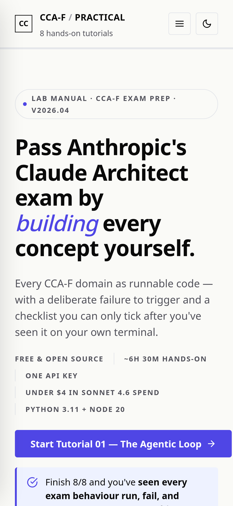

# CCA-F Exam Tutorial

[](LICENSE)
[](https://github.com/jamesbuckett/ccaf-exam-tutorial/stargazers)
[](https://github.com/jamesbuckett/ccaf-exam-tutorial/commits)
[](https://github.com/jamesbuckett/ccaf-exam-tutorial/issues)

> Hands-on study companion for the Claude Certified Architect - Foundations (CCA-F) exam.

## About

Generates a self-contained, single-file HTML workbook of eight runnable tutorials covering every domain of Anthropic's **Claude Certified Architect – Foundations (CCA-F)** exam. The pedagogy is verification-gated: each tutorial is built, then deliberately broken, then ticked off a checklist — passive reading does not advance the page. Pair it with your preferred theory resource and practice questions; this project is independent and unofficial.

## Usage

Open `index.html` in a browser — no build step, no framework, no server. The workbook renders on desktop, tablet, and mobile.

| Desktop | Tablet | Mobile |
|---|---|---|
|  |  |  |

```bash
git clone https://github.com/jamesbuckett/ccaf-exam-tutorial.git
cd ccaf-exam-tutorial
xdg-open index.html   # Linux
# open index.html     # macOS
# start index.html    # Windows
```

A hosted copy is available at [ccaf-exam-tutorial.vercel.app](https://ccaf-exam-tutorial.vercel.app/).

## Project Structure

```
.
├── index.html         # The workbook — open this in a browser
├── study-guide.html   # Companion theory notes
├── screenshots/       # Viewport screenshots (desktop / tablet / mobile)
├── docs/              # Additional documentation assets
├── screenshot.mjs     # Playwright helper that regenerates the screenshots
├── CLAUDE.md          # Project rules for Claude Code
├── LICENSE
└── README.md
```

## Contributing

Issues and pull requests welcome. Please open an issue first to discuss substantial changes.

## License

[MIT](LICENSE) © 2026 James Buckett
