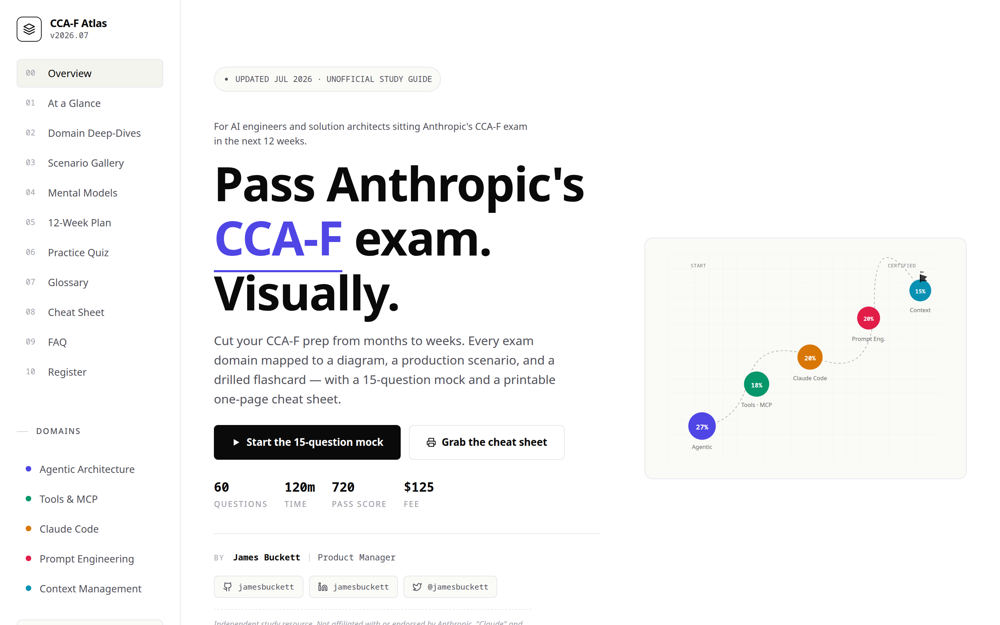
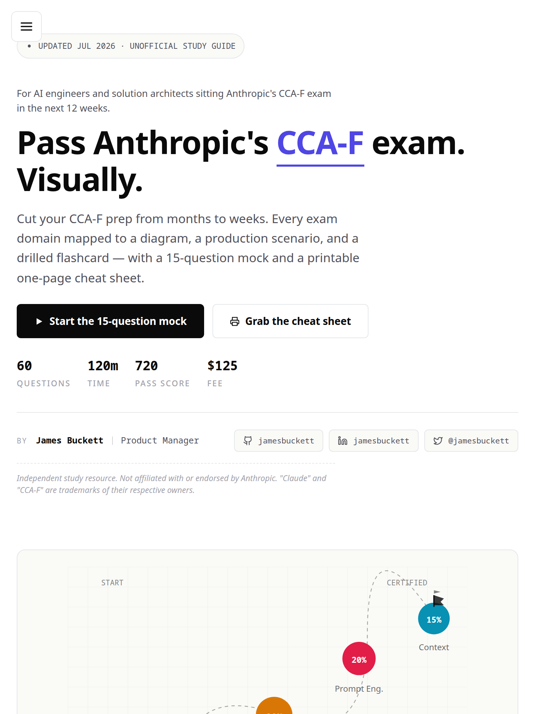
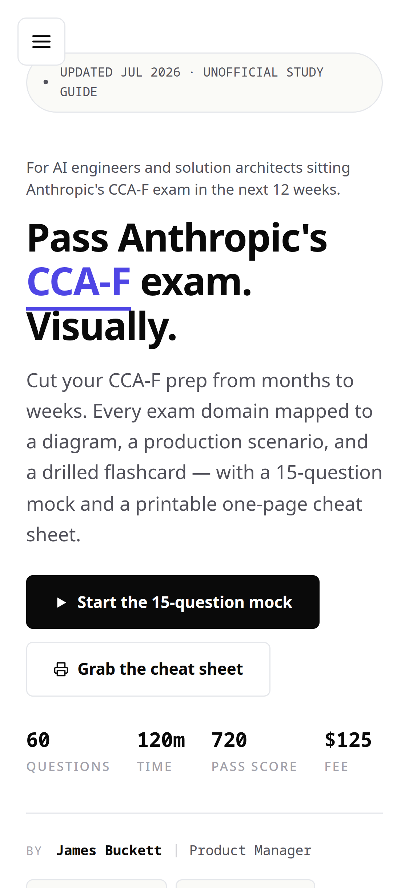

# CCA-F Exam Tutorial

[](LICENSE)
[](https://github.com/jamesbuckett/ccaf-exam-tutorial/stargazers)
[](https://github.com/jamesbuckett/ccaf-exam-tutorial/commits)
[](https://github.com/jamesbuckett/ccaf-exam-tutorial/issues)

> Hands-on study companion for the Claude Certified Architect - Foundations (CCA-F) exam.

## About

Provides a self-contained, single-file HTML workbook of eight runnable tutorials covering every domain of Anthropic's **Claude Certified Architect – Foundations (CCA-F)** exam, plus a companion visual study guide for the theory half. The pedagogy is verification-gated: each tutorial is built, then deliberately broken, then ticked off a checklist — passive reading does not advance the page. Content was fact-checked against the official exam guide and current Anthropic docs in July 2026. Independent and unofficial — not affiliated with or endorsed by Anthropic.

## Usage

Open `index.html` in a browser — no build step, no framework, no server. The workbook renders on desktop, tablet, and mobile.

| Desktop | Tablet | Mobile |
|---|---|---|
|  |  |  |

The companion theory guide, `study-guide.html`, follows the same pattern:

| Desktop | Tablet | Mobile |
|---|---|---|
|  |  |  |

```bash
git clone https://github.com/jamesbuckett/ccaf-exam-tutorial.git
cd ccaf-exam-tutorial
xdg-open index.html   # Linux
# open index.html     # macOS
# start index.html    # Windows
```

A hosted copy is available at [ccaf-exam-tutorial.vercel.app](https://ccaf-exam-tutorial.vercel.app/).

## Project Structure

```
.
├── index.html         # The workbook — open this in a browser
├── study-guide.html   # Companion theory notes, mock exam, cheat sheet
├── screenshots/       # Viewport screenshots for both pages
├── docs/              # Additional documentation assets
├── CLAUDE.md          # Project rules for Claude Code
├── LICENSE
└── README.md
```

## Maintenance

The content decays as Anthropic ships — re-verify these against primary sources roughly quarterly (last full check: 2026-07-02):

- [ ] Model pricing table in `usage.py` and all cost claims → [models overview](https://platform.claude.com/docs/en/about-claude/models/overview)
- [ ] Context-window, `stop_reason`, caching, and structured-output claims → [platform.claude.com/docs](https://platform.claude.com/docs/)
- [ ] MCP transport/auth terminology → [MCP spec](https://modelcontextprotocol.io/specification/latest)
- [ ] Claude Code install command, CLAUDE.md semantics, MCP resource handling → [code.claude.com/docs](https://code.claude.com/docs/)
- [ ] Exam fee, domain weights, delivery, validity in `study-guide.html` → official CCA-F exam guide via [Pearson VUE](https://www.pearsonvue.com/us/en/anthropic.html)
- [ ] Tutorial 08 `prep.py` still extracts >15K chars from the Gutenberg file
- [ ] Update the freshness stamp in the hero and the `v2026.NN` version strings

## Contributing

Issues and pull requests welcome. Please open an issue first to discuss substantial changes.

## License

[MIT](LICENSE) © 2026 James Buckett
