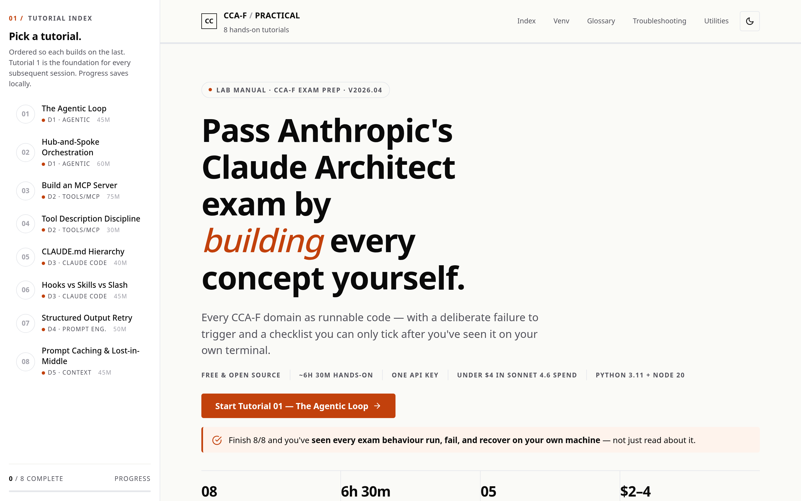

# CCA-F Practical — Hands-On Tutorials for Anthropic's Claude Architect Exam

[](LICENSE)
[](https://github.com/jamesbuckett/ccaf-claude-certified-architect-practical/commits/main)
[](https://github.com/jamesbuckett/ccaf-claude-certified-architect-practical)
[](https://github.com/jamesbuckett/ccaf-claude-certified-architect-practical)
[](https://github.com/jamesbuckett/ccaf-claude-certified-architect-practical/stargazers)
[](https://developer.mozilla.org/en-US/docs/Web/HTML)
[](https://claude.com/claude-code)



**TL;DR** — A single-file HTML workbook of eight runnable tutorials covering every domain of Anthropic's **Claude Certified Architect – Foundations (CCA-F)** exam. Roughly **6 h 30 m** of hands-on time, **\$2–4** in Sonnet 4.6 API spend, one `ANTHROPIC_API_KEY`. Every concept is built, then deliberately broken, then verified on a checklist.

> **Independent and unofficial.** This workbook is not affiliated with or endorsed by Anthropic. Pair it with your preferred theory resource and practice questions.

## What it is

`index.html` is a self-contained study guide — no build step, no framework, no server. Open the file in a browser, follow the tutorials in order, and run each one against the Anthropic SDK or Claude Code on your laptop. Progress is tracked locally per tutorial; the FAQ, glossary (33 terms), and troubleshooting sections live in the same page.

The pedagogy is deliberately verification-gated: a tutorial is "done" only after you have **observed the concept work, observed it break, and ticked the checklist**. Passive reading does not advance the page.

## What's inside

Eight tutorials, ordered so each builds on the last. Domains map to the published CCA-F exam blueprint.

| #  | Tutorial                              | Domain                  | Time   |
|----|---------------------------------------|-------------------------|--------|
| 01 | The Agentic Loop                      | D1 · Agentic            | 45 m   |
| 02 | Hub-and-Spoke Orchestration           | D1 · Agentic            | 60 m   |
| 03 | Build an MCP Server                   | D2 · Tools / MCP        | 75 m   |
| 04 | Tool Description Discipline           | D2 · Tools / MCP        | 30 m   |
| 05 | CLAUDE.md Hierarchy in Claude Code    | D3 · Claude Code        | 40 m   |
| 06 | Hooks vs Skills vs Slash Commands     | D3 · Claude Code        | 45 m   |
| 07 | Structured Output with Tool-Use Retry | D4 · Prompt Engineering | 50 m   |
| 08 | Prompt Caching & Lost-in-the-Middle   | D5 · Context            | 45 m   |

Every tutorial follows the same structure: **Setup → Code trace → Walkthrough → Build-and-break exercise → Verification checklist → Cleanup → Further exploration**.

## Prerequisites

**Toolchain** — one-time install, roughly two minutes.

- Python **3.11+** (each tutorial creates its own `.venv`, so Python packages are installed per-tutorial)
- Node **20 LTS** (only required for tutorials that use [Claude Code](https://claude.com/claude-code))
- An Anthropic API key exported as `ANTHROPIC_API_KEY`
- Comfort with a terminal

**Budget** — \$2–4 on Claude Sonnet 4.6 across all eight tutorials. Every agentic loop ships with a `MAX_ITERATIONS` guard so runaway spend is structurally impossible.

## Run it locally

The workbook is a single static file — no build, no server, no dependencies beyond a browser.

```bash
git clone https://github.com/jamesbuckett/ccaf-claude-certified-architect-practical.git
cd ccaf-claude-certified-architect-practical
xdg-open index.html   # Linux
# open index.html     # macOS
# start index.html    # Windows
```

Then follow **Tutorial 01 — The Agentic Loop** to set up your first `.venv` and trigger your first round-trip against the Anthropic SDK.

## Repo layout

```
.
├── index.html          # The workbook — open this in a browser
├── study-guide.html    # Companion theory notes
├── docs/
│   └── screenshot.png  # Hero screenshot used above
├── CLAUDE.md           # Project rules for Claude Code (light theme, single file, etc.)
├── LICENSE             # MIT
└── README.md
```

## Verified against

Last verified against `anthropic >= 0.40` and **Claude Sonnet 4.6** on 2026-04-14. If a command no longer behaves as the workbook describes, please [open an issue](https://github.com/jamesbuckett/ccaf-claude-certified-architect-practical/issues).

## License

Released under the [MIT License](LICENSE). Copyright © 2026 James Buckett.

## Author

**James Buckett**

- GitHub — [@jamesbuckett](https://github.com/jamesbuckett)
- LinkedIn — [jamesbuckett](https://www.linkedin.com/in/jamesbuckett)
- Twitter / X — [@jamesbuckett](https://twitter.com/jamesbuckett)
